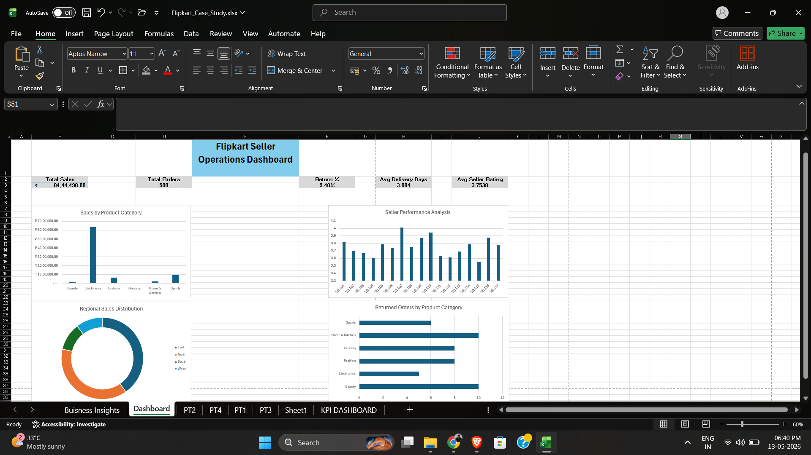
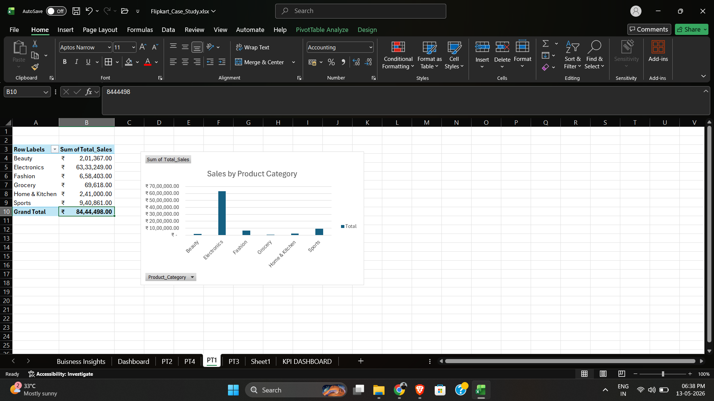
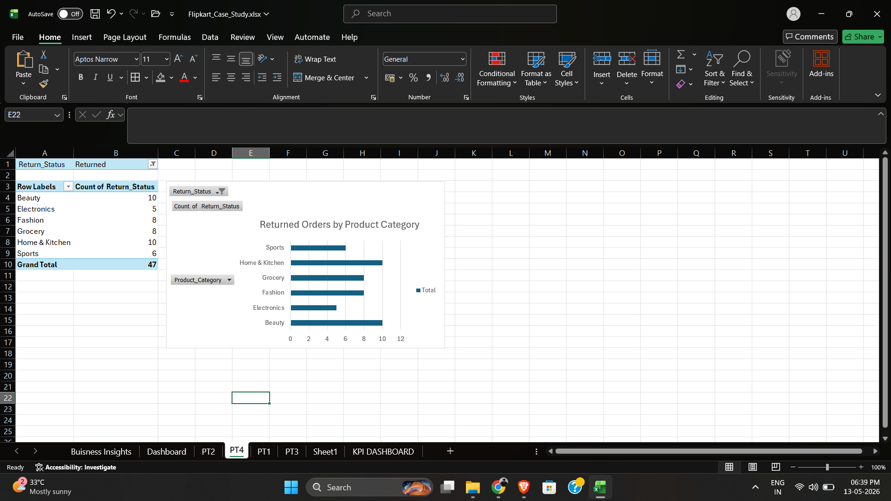

# Flipkart Data Analysis Project

## Overview
This project presents a business analytics and sales analysis case study inspired by Flipkart operations. The analysis was performed using Microsoft Excel to derive insights related to sales performance, returns, regional trends, and seller performance.

---

## Objectives
- Analyze sales and order trends
- Identify return rate patterns
- Evaluate seller performance
- Study regional sales distribution
- Create visual dashboards and KPI reports

---

## Tools Used
- Microsoft Excel
- Pivot Tables
- Pivot Charts
- Data Cleaning
- Dashboard Creation
- Business Analytics

---

## Key Insights
- Identified regions with highest sales contribution
- Analyzed return percentages and customer behavior
- Compared seller performance metrics
- Built KPI-based dashboards for decision-making
- Visualized sales trends using charts and graphs

---

## Project Files
- `Flipkart_Case_Study.xlsx` → Main Excel analysis file
- `Flipkart_Report.pdf` → Business analysis report
- `Dashboard.png` → Dashboard visualization
- `Sales_chart.png` → Sales trend analysis
- `Return_analysis.png` → Return rate analysis
- `Regional_sales.png` → Regional performance analysis
- `Seller_analysis.png` → Seller performance insights

---

## Screenshots

### Dashboard

### Sales Analysis

### Return Analysis

---

## Skills Demonstrated
- Data Analysis
- Business Intelligence
- Excel Analytics
- Reporting & Visualization
- Problem Solving

---

## Author
Subhankar Mahakud
